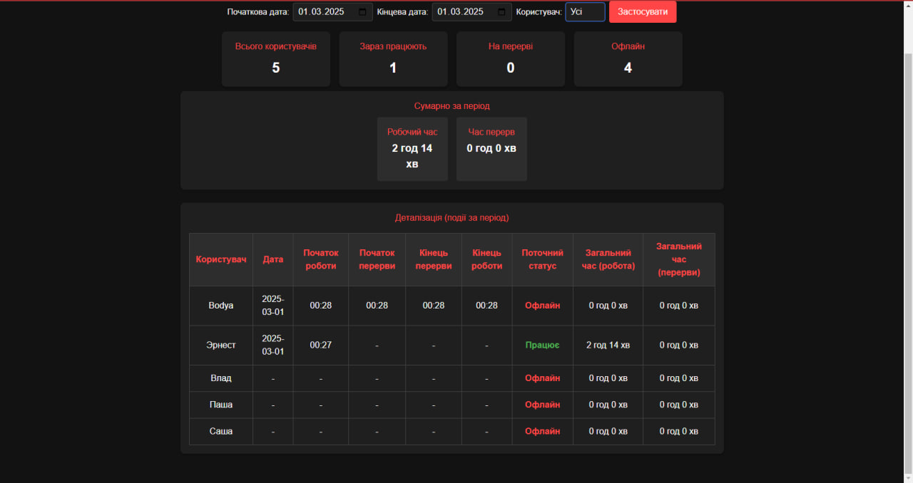
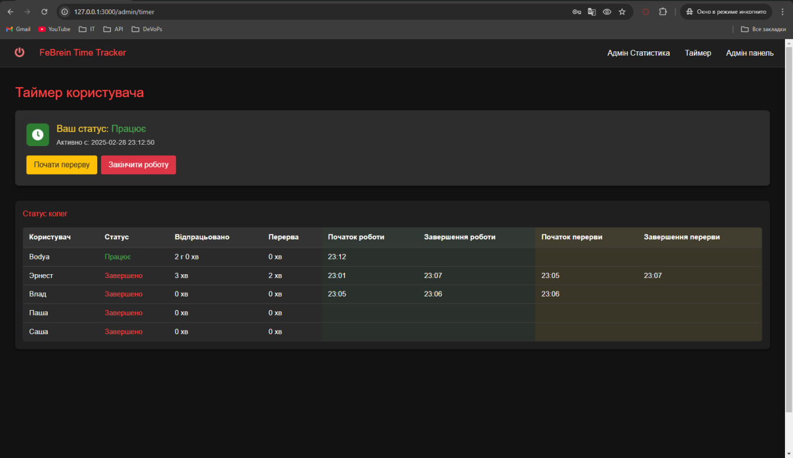
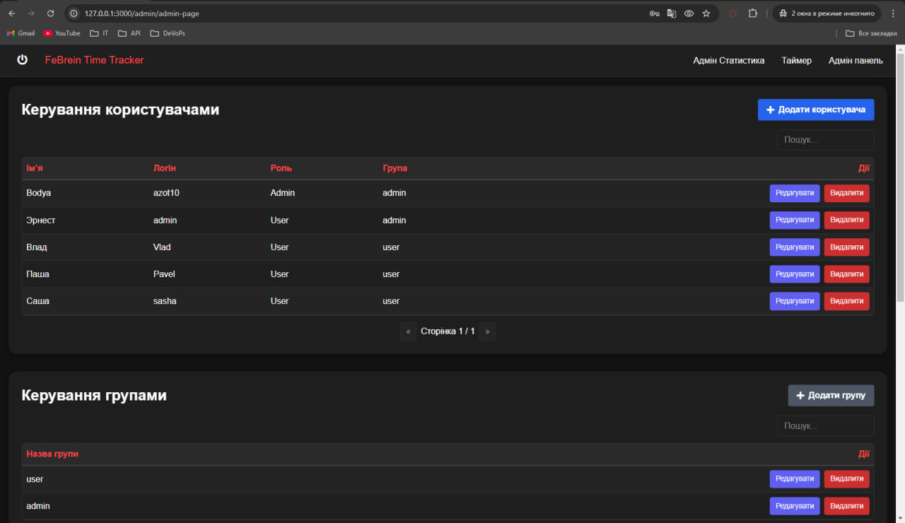

# FeBrein Time Tracker (v5.6.3)

Це кросплатформний застосунок для робочого таймера на **Laravel (PHP)** (бекенд) та **Vue.js** (фронтенд).  
Забезпечує повноцінне відстеження робочого часу, включно з перервами, та підтримує **ролевий доступ** (Адмін/Користувач).






## Основні функції

- **Ролевий доступ**  
  - **Адмін**: управління користувачами, групами (відділами), таймлогами (часом роботи).  
  - **Користувач**: персональний таймер, список колег, можливість почати/завершити роботу чи перерву.
- **Трекінг часу**  
  - Почати/закінчити роботу, почати/закінчити перерву.  
  - Запобігання повторному початку роботи в один день (після завершення зміни).
- **Адмін-панель**  
  - Додавання/редагування груп (відділів).  
  - Додавання/редагування користувачів (ролі, групи).  
  - Перегляд і корекція таймлогів (якщо хтось забув вчасно завершити зміну).
- **Крон-задача**  
  - Можна налаштувати щоденний запуск (наприклад, о 23:59) для автоматичного завершення активних змін.
- **Інтерфейс та безпека**  
  - Оновлений дизайн (замість «Вихід» – «Вимкнути»).  
  - Різні панелі/дашборди для Адміна і Користувача.  
  - Захист на рівні бекенду (навіть якщо фронтенд «пустить» користувача, сервер відмовить у доступі без належних прав).

---

## Встановлення

### 1. Окремі теки: Front-end та Back-end
1. **Back-end**: розгорніть Laravel-проєкт (наприклад, `/var/www/laraveldev`).
2. **Front-end**: зберіть Vue (`npm run build` або `yarn build`), розмістіть вихідні файли в `/var/www/vuefront`.
3. **Alias / proxy** для `/api`:  
   ```apache
   Alias /api /var/www/laraveldev/public
   <Directory "/var/www/laraveldev/public">
       Require all granted
       AllowOverride All
   </Directory>


Якщо маршрути бекенду чутливі до /api у URI, перевірте, чи не видаляє Apache/Nginx цей префікс.

2. Об’єднаний проєкт (Front у public бекенду)

    Скопіюйте зкомпільовані файли фронту (Vue) в laraveldev/public.
    Тепер бекенд (Laravel) і фронт обслуговуються однією папкою.
    Немає потреби в окремому alias — усі запити до /api/... лишаються для Laravel.

3. Windows (XAMPP) приклад
    Копіюємо бекенд у C:\xampp\htdocs\laraveldev.
    Якщо фронт окремо — або C:\xampp\htdocs\vuefront, або покладіть у laraveldev/public.
    Додайте запис у C:\Windows\System32\drivers\etc\hosts, наприклад:
    ```apache
    127.0.0.1 smartime.local

У httpd-vhosts.conf налаштуйте VirtualHost на smartime.local.

Використання

- **Авторизація**
    - Адмін/Користувач отримують різні меню та дашборди.
- **Таймер**
    - Почати роботу → event_id=1, відображається «працює».
    - Почати перерву → event_id=2, статус «перерва».
    - Закінчити перерву → event_id=3, повертається «працює».
    - Закінчити роботу → event_id=4, зміна завершена, неможливо почати знову.
- **Адмін-панель**
    - Керування групами, користувачами, таймлогами.
    - Можливість вручну коригувати дані (якщо забули зупинити роботу).
- **Крон-задача**
    - О 23:59 (чи інший час) можна викликати php artisan ... (потрібна своя команда) для завершення усіх активних сесій.

